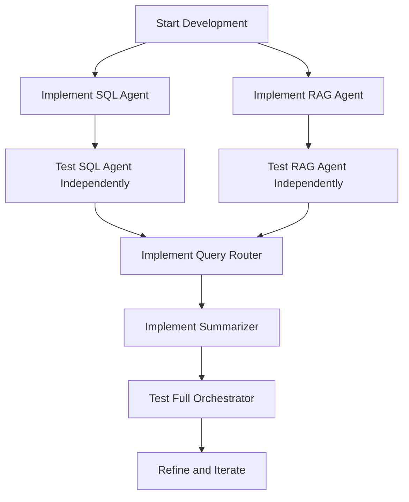

# HK Housing Estates Chatbot

A Langchain-based chatbot for Hong Kong housing estates information using RAG and SQL agents.

## Architecture Overview

1. **User Query**: Accepts questions about HK housing estates
2. **Orchestration**: Langgraph manages the conversation flow
3. **Query Routing**: Determines whether to use SQL database or RAG retrieval
4. **Data Sources**:
   - SQLite database with estate/building/transaction data
   - ChromaDB with wiki-scraped text for RAG
5. **Agents**:
   - SQL Agent: Queries structured housing data
   - RAG Agent: Retrieves from wiki text corpus
6. **Response**: Summarizes and returns comprehensive answers

## Development Flow

## Setup Steps

1. Install dependencies: `pip install -r requirements.txt`
2. Configure environment: Copy `.env.template` to `.env` and fill in values
3. Ensure Ollama is running locally with required model
4. Start development: `python src/main.py`

## Configuration

- LLM Provider: Ollama (local) or OpenRouter (cloud)
- Database: SQLite with housing transaction data
- Vector Store: ChromaDB with wiki content
- Models: Configurable via environment variables

## Data Sources

- `data/agency/agency_data.db`: Structured housing data
- `data/wiki/`: Scraped wiki pages for contextual information