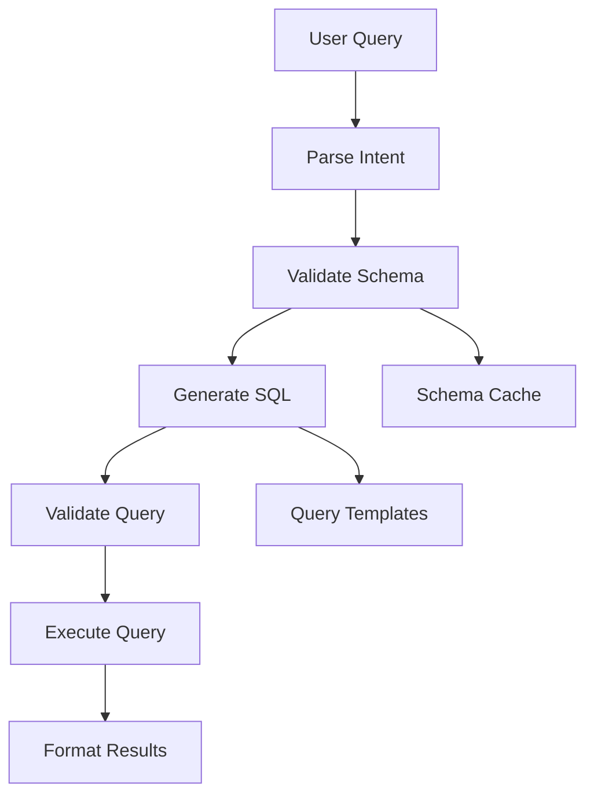

# Custom SQL Agent Architecture

## Problem
LangChain community SQL agent suffers from:
- Schema hallucinations (queries non-existent tables)
- Black-box behavior (opaque internal reasoning)
- Poor error recovery and observability

## Solution: Step-by-Step Pipeline

## Key Steps

1. **Parse Intent** → Extract tables, columns, filters from natural language
2. **Validate Schema** → Check against actual database schema
3. **Generate SQL** → Build query using validated schema
4. **Validate Query** → Syntax and safety checks
5. **Execute Query** → Run with error handling
6. **Format Results** → Structure output for user

## Benefits
- Eliminates hallucinations through explicit validation
- Full observability at each step
- Easy to customize and extend
- Better error handling and recovery