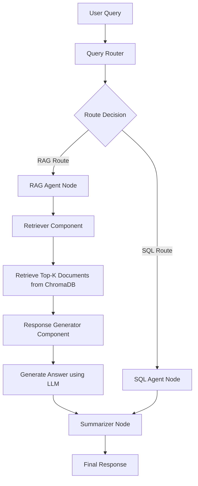

# RAG Agent Architecture

## Overview

The RAG (Retrieval-Augmented Generation) Agent retrieves relevant information from HK housing estate wiki text stored in ChromaDB and generates contextual answers using an LLM. It complements the SQL Agent by handling explanatory, historical, and descriptive queries that require unstructured text data.

## Architecture Components

## Component Breakdown

### 1. Retriever (`rag_agent_components/retriever.py`)
- Loads persisted ChromaDB vector store
- Embeds user query and performs similarity search
- Returns top-k relevant document chunks
- Handles initialization and error cases

### 2. Response Generator (`rag_agent_components/response_generator.py`)
- Formats retrieved documents into context
- Uses LLM with custom prompt to generate coherent answers
- Handles cases with insufficient context
- Provides structured response output

### 3. RAG Agent (`rag_agent.py`)
- Main orchestrator class with initialization
- LangGraph-compatible node function
- Global instance management
- Error handling and logging

## Data Flow

1. **Query Reception**: User query routed to RAG agent
2. **Retrieval**: Query embedded and matched against wiki text vectors
3. **Context Assembly**: Top documents formatted as context
4. **Generation**: LLM synthesizes answer from context
5. **Response**: Formatted answer returned to summarizer

## Configuration

- Vector Store: ChromaDB with persisted embeddings in `data/chroma_db/`
- Embeddings: Ollama embeddings (configurable)
- Retrieval: Top-5 similar documents by default
- LLM: Configured via `llm_connector.py`

## Integration Points

- **LangGraph**: `rag_agent_node` function for graph integration
- **Summarizer**: Combines RAG results with SQL results if needed
- **Config**: Uses `Config.CHROMA_DB_PATH` for vector store location
- **Logging**: Comprehensive logging via `housing_logger`

## Future Enhancements

- Hybrid search (keyword + vector)
- Metadata filtering for estate-specific queries
- Response confidence scoring
- Multi-turn conversation context